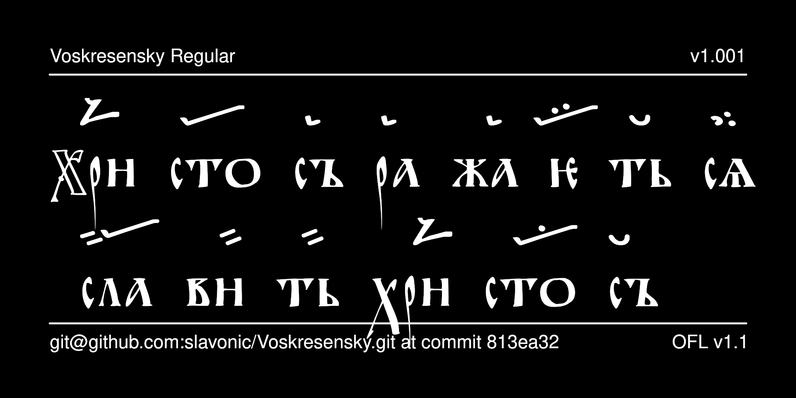

# Voskresensky Typeface

Voskresensky is a typeface for typesetting Ustav-era Slavonic texts and archaic Znamenny Notation. It is intended for representing text from early East Slavic Church Slavonic notated manuscripts. The capital letters may also be used as decorative initials in editions of other Ustav-era manuscripts, or for decorative purposes more generally.



## History

The Cyrillic glyphs were designed by Nikita Simmons and are loosely based on the characters of the Voskresensky Hirmologion ([Moscow, State Historical Museum, Voskr. 28](https://catalog.shm.ru/entity/OBJECT/178484); end of the twelfth century), giving the name to the font.

The glyphs for Znamenny Notation were initially distributed as a separate font called Smolensky. They were drawn by Aleksandr Andreev from photographs of the following notated manuscripts:
* The Novgorod Sticherarion ([St Petersburg, National Library of Russia, Sof. 384](https://nlr.ru/manuscripts/RA1527/elektronnyiy-katalog?ab=68334349-68DD-4B9D-893C-63C5E52CF94A); dated 1156-1163)
* St. Petersburg Sticherarion (St Petersburg, Russian Academy of Sciences Library, 34.7.6; twelfth century; based on the edition: STICHERARIUM PALAEOSLAVICUM PETROPOLITANUM (St Petersburg, Library of the Russian Academy of Sciences (BAN), ms. 34.7.6, 12th c.), in two parts, edited by Nicolas Schidlovsky, Copenhagen: C.A. Reitzel 2000)
* Hirmologion of Grigorovich (Mt Athos, Hilandar, Slav. 308 + [Moscow, Russian State Library,  Grig. 37](https://lib-fond.ru/lib-rgb/87/f-87-37/) + [St. Petersburg, National Library of Russia, Q.п.I.75](https://nlr.ru/manuscripts/RA1527/elektronnyiy-katalog?ab=0DC3F2B8-50DE-472F-A809-4E9B18A5C2E3); beginning of the thirteenth century); the first portion based on the edition: FRAGMENTA CHILIANDARICA PALAEOSLAVICA (Athos, Chilandari Monastery, codd. 307 (12th. c.) and 308 (13th c.)), in two parts, edited by Roman Jakobson, Copenhagen: Munksgaard 1957.

Subsequently, the Smolensky font was discontinued and merged with the Voskresensky font to create a font that supports both Ustav-era Cyrillic and archaic Znamenny Notation. The font was released under SIL OFL v. 1.1. as part of the [Slavonic Computing Initiative](https://sci.ponomar.net/fonts.html).

## License

This Font Software is licensed under the SIL Open Font License,
Version 1.1. This license is available with a FAQ at
[https://openfontlicense.org/](https://openfontlicense.org/).

## Building the Fonts

The font source is stored in a FontForge SFD file in the `sources/` directory. All modifications should be made in FontForge, resulting in an updated SFD file. This file is then converted to UFO format by running the convert script. From terminal:

```
cd your/local/project/directory
./convert.sh
```

The font can then be built using fontmake and gftools by running:

```
make build
```

Note that this requires Python and will install all of the necessary libraries and tools into a virtualenv at `venv/`.

To delete the virtualenv and the results of the build, run:

```
make clean
```

To build the sample image the sits at the top of this README, run:

```
make images
```

The commands `make update` and `make update-project-template` update the repository structure and Python dependencies and should be run periodically.

Google's master repository also had a GitHub workflow for building the fonts in the cloud on push, but this seems to always fail because of incorrect dependencies, so has been disabled. Instead, built binaries are stored on GitHub in the `fonts/` directory.

## Features

* The font provides a number of stylistic alternatives for some glyphs:
- narrow variant of capital O U+041E
- connected variant of yery U+042B and U+044B and U+A651 and U+A650
- stacked variant of digraph uk U+0479
- various variants of the titlo U+0483 and pokrytie U+0487
- variant of blended yus U+A659

* The font provides only those Znamenny characters necessary for archaic notation. For example, it does not provide any cinnabar marks or priznak control characters, since they are not used in notation of the target era.

## More Church Slavonic and Znamenny Fonts

See the website for [Church Slavonic fonts](https://sci.ponomar.net/fonts.html) and [Znamenny fonts](https://sci.ponomar.net/music.html). In particular, you may need the [Mezenets font](https://github.com/slavonic/Mezenets), which provides the necessary glyphs and features for modern (since the seventeenth century) Znamenny Notation as well as for Kazan (Put/Demestvenny) Notation.
