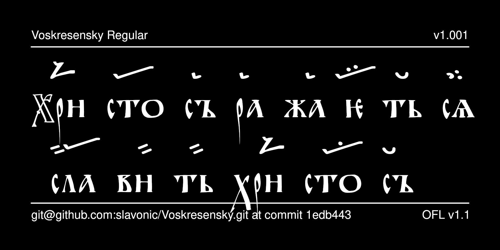

# Voskresensky Typeface

Voskresensky is a typeface modelled after the script of the Voskresensky Hirmologion (State Historical Museum, Voskr. 28; end of the twelfth century). It provides both Cyrillic characters and characters of archaic Znamenny Notation and is intended for representing text from Ustav-era Church Slavonic notated manuscripts. The capital letters may also be used as decorative initials in editions of Ustav-era manuscripts.



## History

The Cyrillic glyphs were designed by Nikita Simmons and the glyphs for Znamenny notation by Aleksandr Andreev. The font was released under SIL OFL v. 1.1. as part of the [Slavonic Computing Initiative](https://sci.ponomar.net/fonts.html).

## License

This Font Software is licensed under the SIL Open Font License,
Version 1.1. This license is available with a FAQ at
[https://openfontlicense.org/](https://openfontlicense.org/).

## Building the Fonts

The font source is stored in a FontForge SFD file in the `sources/` directory. All modifications should be made in FontForge, resulting in an updated SFD file. This file is then converted to UFO format by running the convert script. From terminal:

```
cd your/local/project/directory
./convert.sh
```

The font can then be built using fontmake and gftools by running:

```
make build
```

Note that this requires Python and will install all of the necessary libraries and tools into a virtualenv at `venv/`.

To delete the virtualenv and the results of the build, run:

```
make clean
```

To build the sample image the sits at the top of this README, run:

```
make images
```

The commands `make update` and `make update-project-template` update the repository structure and Python dependencies and should be run periodically.

Google's master repository also had a GitHub workflow for building the fonts in the cloud on push, but this seems to always fail because of incorrect dependencies, so has been disabled. Instead, built binaries are stored on GitHub in the `fonts/` directory.

## Features

* The font provides a number of stylistic alternatives for some glyphs:
- narrow variant of capital O U+041E
- connected variant of yery U+042B and U+044B and U+A651 and U+A650
- stacked variant of digraph uk U+0479
- various variants of the titlo U+0483 and pokrytie U+0487
- variant of blended yus U+A659


## More Church Slavonic Fonts

See the [main repository](https://github.com/typiconman/fonts-cu/issues) and the [website](https://sci.ponomar.net/fonts.html).